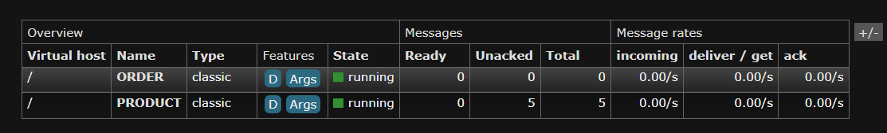

# 🛒 Ordering Microservices

A scalable and modular Ordering Microservices system designed to handle order processing in a distributed architecture. This project follows microservices best practices with independent services communicating via HTTP and message queues.

## 📦 Project Overview

This repository contains the microservices responsible for handling orders, including:

- **Order Service** – Handles order creation, updates, and queries.
- **Inventory Service** – Manages stock levels and validates availability.
- **Payment Service** – Processes payments and handles transaction statuses.
- **Notification Service** – Sends order updates to users via email/SMS.
- **API Gateway** – Routes and secures external requests to internal services.
- **Service Registry (Optional)** – Enables service discovery and health checks.

## 🧱 Microservices Architecture

## Rabbit MQ
